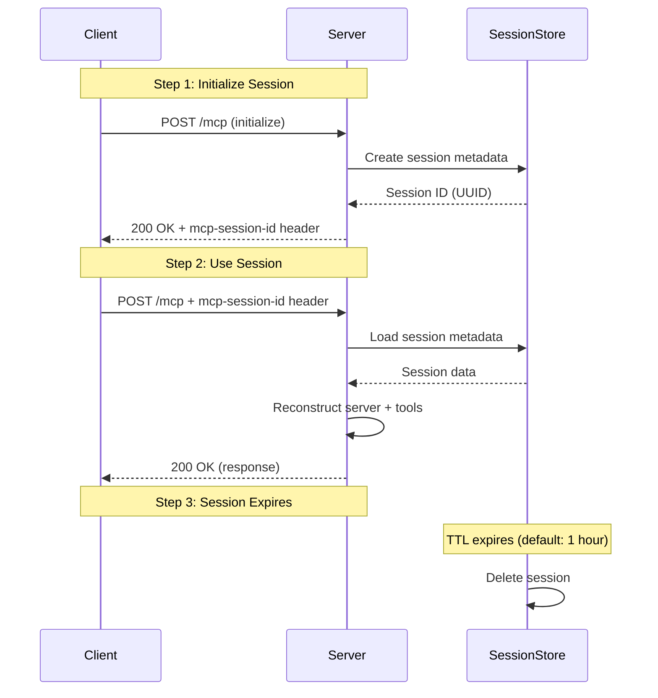

# HTTP Session Management

## Overview

The `@mcp-typescript-simple` framework uses **header-based session management** for HTTP transport mode. This differs from traditional REST APIs where session tokens might be in the response body.

**Key Point:** Session IDs are in **HTTP headers**, NOT in the JSON response body.

## Why Header-Based Sessions?

1. **Stateless HTTP**: Each request is independent, server instances don't persist
2. **MCP Protocol Compatibility**: MCP JSON-RPC protocol doesn't include session management
3. **Clean Separation**: Session management separate from protocol messages
4. **Standard Pattern**: Follows HTTP best practices (like cookies, auth tokens)

## Session Flow

### Step 1: Initialize Session

**Client sends initialize request:**

```bash
curl -i -X POST http://localhost:3000/mcp \
  -H 'Content-Type: application/json' \
  -H 'Accept: application/json, text/event-stream' \
  -d '{
    "jsonrpc": "2.0",
    "method": "initialize",
    "params": {
      "protocolVersion": "2024-11-05",
      "capabilities": {},
      "clientInfo": {
        "name": "my-client",
        "version": "1.0.0"
      }
    },
    "id": 1
  }'
```

**Server responds with session ID in HEADER:**

```http
HTTP/1.1 200 OK
Content-Type: application/json
mcp-session-id: 550e8400-e29b-41d4-a716-446655440000
                ^^^^^^^^^^^^^^^^^^^^^^^^^^^^^^^^^^^^^^^^^
                Extract this value!

{
  "jsonrpc": "2.0",
  "result": {
    "protocolVersion": "2024-11-05",
    "capabilities": { "tools": {} },
    "serverInfo": {
      "name": "mcp-typescript-simple",
      "version": "1.0.0"
    }
  },
  "id": 1
}
```

**CRITICAL:** The session ID is in the `mcp-session-id` header, **NOT** in the JSON response body!

### Step 2: Subsequent Requests

**Pass session ID in request header:**

```bash
curl -X POST http://localhost:3000/mcp \
  -H 'Content-Type: application/json' \
  -H 'Accept: application/json, text/event-stream' \
  -H 'mcp-session-id: 550e8400-e29b-41d4-a716-446655440000' \
  -d '{
    "jsonrpc": "2.0",
    "method": "tools/list",
    "id": 2
  }'
```

**Server reconstructs session:**
1. Receives `mcp-session-id` header
2. Loads session metadata from storage (Redis/memory)
3. Creates fresh MCP server instance
4. Re-registers tools from toolRegistry
5. Processes request
6. Returns response

## Required HTTP Headers

### For All Requests

```http
Content-Type: application/json
Accept: application/json, text/event-stream
```

**Why the dual Accept header?**
- `application/json` - For JSON-RPC responses
- `text/event-stream` - For streaming responses (if supported)

**Missing Accept header → 406 Not Acceptable error**

### For Session Requests (After Initialize)

```http
mcp-session-id: <uuid>
```

**Missing session ID → Session not found error**

## Session Storage

Sessions are stored in one of three backends:

### 1. Memory (Default - Development Only)

```bash
# No configuration needed
npm run dev:http
```

**Pros:**
- Zero configuration
- Fast

**Cons:**
- Lost on server restart
- Single server instance only (no horizontal scaling)

### 2. Redis (Recommended - Production)

```bash
# .env
REDIS_URL=redis://localhost:6379

npm run dev:http
```

**Pros:**
- Persistent across restarts
- Horizontal scaling (multiple server instances)
- Production-ready

**Cons:**
- Requires Redis server

### 3. File Storage (Development/Testing)

```bash
# .env
SESSION_STORE_TYPE=file
SESSION_FILE_PATH=./data/sessions.json

npm run dev:http
```

**Pros:**
- Persistent across restarts
- No external dependencies

**Cons:**
- File locking issues with concurrent access
- Not suitable for horizontal scaling

## Common Mistakes

### ❌ Mistake #1: Looking for Session ID in Response Body

```javascript
// ❌ WRONG - session ID is NOT in response body
const response = await fetch('http://localhost:3000/mcp', {
  method: 'POST',
  body: JSON.stringify({ jsonrpc: '2.0', method: 'initialize', ... })
});
const data = await response.json();
const sessionId = data.sessionId;  // ❌ This doesn't exist!
```

```javascript
// ✅ CORRECT - session ID is in response HEADERS
const response = await fetch('http://localhost:3000/mcp', {
  method: 'POST',
  headers: {
    'Content-Type': 'application/json',
    'Accept': 'application/json, text/event-stream'
  },
  body: JSON.stringify({ jsonrpc: '2.0', method: 'initialize', ... })
});

const sessionId = response.headers.get('mcp-session-id');  // ✅ Correct!
```

### ❌ Mistake #2: Missing Accept Header

```bash
# ❌ WRONG - Missing Accept header
curl -X POST http://localhost:3000/mcp \
  -H 'Content-Type: application/json' \
  -d '{"jsonrpc":"2.0","method":"initialize",...}'

# Response: 406 Not Acceptable
```

```bash
# ✅ CORRECT - Include dual Accept header
curl -X POST http://localhost:3000/mcp \
  -H 'Content-Type: application/json' \
  -H 'Accept: application/json, text/event-stream' \
  -d '{"jsonrpc":"2.0","method":"initialize",...}'
```

### ❌ Mistake #3: Not Passing Session ID on Subsequent Requests

```bash
# ❌ WRONG - No session ID header
curl -X POST http://localhost:3000/mcp \
  -H 'Content-Type: application/json' \
  -H 'Accept: application/json, text/event-stream' \
  -d '{"jsonrpc":"2.0","method":"tools/list","id":2}'

# Response: Session not found error
```

```bash
# ✅ CORRECT - Include session ID header
curl -X POST http://localhost:3000/mcp \
  -H 'Content-Type: application/json' \
  -H 'Accept: application/json, text/event-stream' \
  -H 'mcp-session-id: 550e8400-e29b-41d4-a716-446655440000' \
  -d '{"jsonrpc":"2.0","method":"tools/list","id":2}'
```

## JavaScript/TypeScript Client Example

### Basic Client

```typescript
class MCPClient {
  private baseUrl: string;
  private sessionId: string | null = null;

  constructor(baseUrl: string) {
    this.baseUrl = baseUrl;
  }

  async initialize() {
    const response = await fetch(`${this.baseUrl}/mcp`, {
      method: 'POST',
      headers: {
        'Content-Type': 'application/json',
        'Accept': 'application/json, text/event-stream'
      },
      body: JSON.stringify({
        jsonrpc: '2.0',
        method: 'initialize',
        params: {
          protocolVersion: '2024-11-05',
          capabilities: {},
          clientInfo: { name: 'my-client', version: '1.0.0' }
        },
        id: 1
      })
    });

    // Extract session ID from headers
    this.sessionId = response.headers.get('mcp-session-id');

    if (!this.sessionId) {
      throw new Error('No session ID received from server');
    }

    return response.json();
  }

  async callTool(toolName: string, args: any) {
    if (!this.sessionId) {
      throw new Error('Not initialized - call initialize() first');
    }

    const response = await fetch(`${this.baseUrl}/mcp`, {
      method: 'POST',
      headers: {
        'Content-Type': 'application/json',
        'Accept': 'application/json, text/event-stream',
        'mcp-session-id': this.sessionId  // Pass session ID
      },
      body: JSON.stringify({
        jsonrpc: '2.0',
        method: 'tools/call',
        params: { name: toolName, arguments: args },
        id: 2
      })
    });

    return response.json();
  }
}

// Usage
const client = new MCPClient('http://localhost:3000');
await client.initialize();
const result = await client.callTool('hello', { name: 'World' });
console.log(result);
```

## Session Lifecycle



## Session Configuration

### Session Timeout

```bash
# .env
SESSION_TTL=3600  # 1 hour (default)
```

### Session Cleanup

Sessions are automatically cleaned up:
- **Memory storage**: On server restart
- **Redis storage**: Via Redis TTL (automatic)
- **File storage**: Manual cleanup required

### Manual Session Cleanup (File Storage)

```bash
# Delete expired sessions from file storage
npm run dev:clean:sessions
```

## Troubleshooting

### "Session not found" error

**Cause:** Missing or invalid `mcp-session-id` header

**Fix:**
1. Check that you extracted session ID from initialize response **headers**
2. Verify session ID is being passed in **request headers**
3. Check session hasn't expired (default: 1 hour)

### "406 Not Acceptable" error

**Cause:** Missing `Accept` header

**Fix:**
```http
Accept: application/json, text/event-stream
```

### Sessions lost on server restart

**Cause:** Using memory storage (default)

**Fix:** Configure Redis for persistent sessions:
```bash
# .env
REDIS_URL=redis://localhost:6379
```

### Tools disappear after session resume

**Cause:** Missing toolRegistry in transport initialization

**Fix:** See [Tool Registry for HTTP Mode](./03-tool-registry-http-mode.md)

## Best Practices

### 1. Extract Session ID from Headers

Always extract from response headers, never assume it's in body:

```typescript
const sessionId = response.headers.get('mcp-session-id');
```

### 2. Store Session ID Securely

- Memory (for short-lived clients)
- Secure storage (for long-lived clients)
- Never log session IDs in production

### 3. Handle Session Expiration

```typescript
try {
  await client.callTool('hello', { name: 'World' });
} catch (error) {
  if (error.message.includes('Session not found')) {
    // Re-initialize session
    await client.initialize();
    // Retry request
    await client.callTool('hello', { name: 'World' });
  }
}
```

### 4. Use Redis in Production

- Persistent across restarts
- Horizontal scaling support
- Automatic TTL-based cleanup

## Related Documentation

- [Tool Registry for HTTP Mode](./03-tool-registry-http-mode.md) - Why toolRegistry is needed
- [Session Management](../session-management.md) - Deep dive on Redis persistence
- [Transport Architecture](../architecture/transports.md) - How transports work

## Summary

**Key Takeaways:**

1. ✅ Session ID is in **headers**, not body
2. ✅ Dual `Accept` header is **required**
3. ✅ Pass session ID in **subsequent requests**
4. ✅ Use **Redis** for production deployments
5. ✅ Handle session expiration gracefully

**Quick Reference:**

```bash
# Initialize - extract session ID from headers
curl -i http://localhost:3000/mcp -d '{"method":"initialize",...}'
# Look for: mcp-session-id: <uuid>

# Subsequent requests - pass session ID in headers
curl http://localhost:3000/mcp \
  -H 'mcp-session-id: <uuid>' \
  -d '{"method":"tools/list",...}'
```
